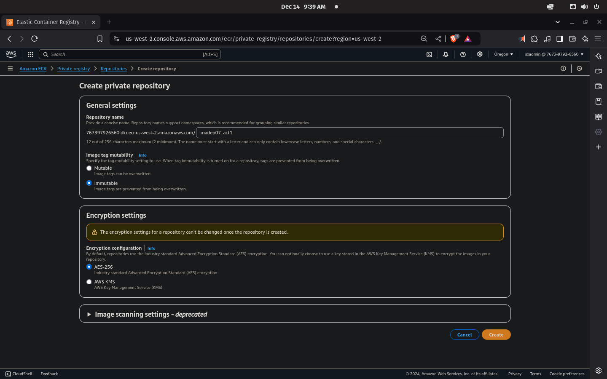
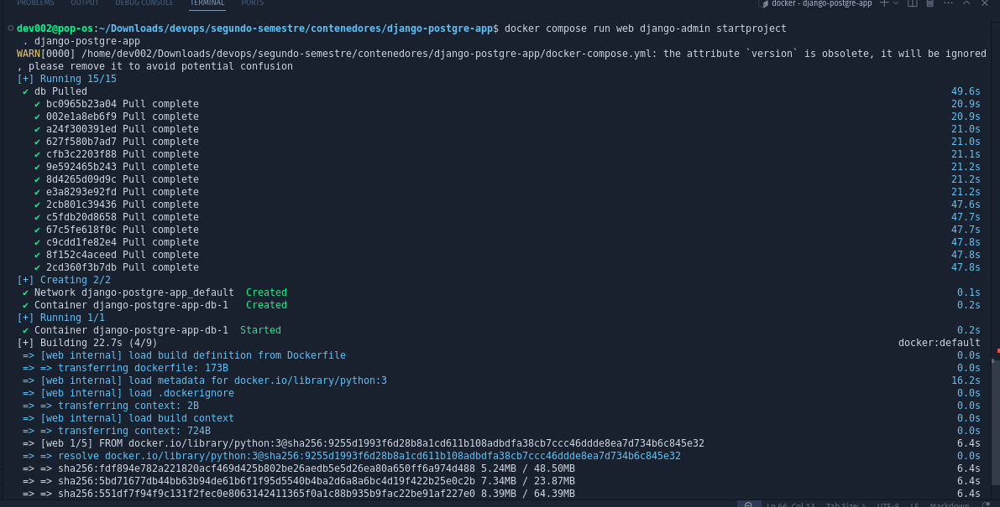
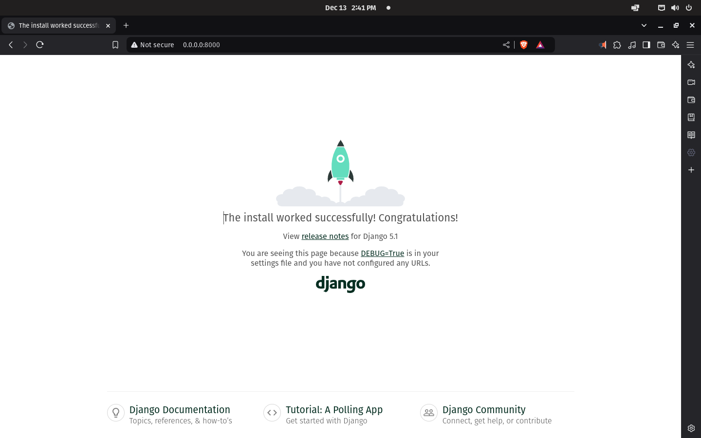
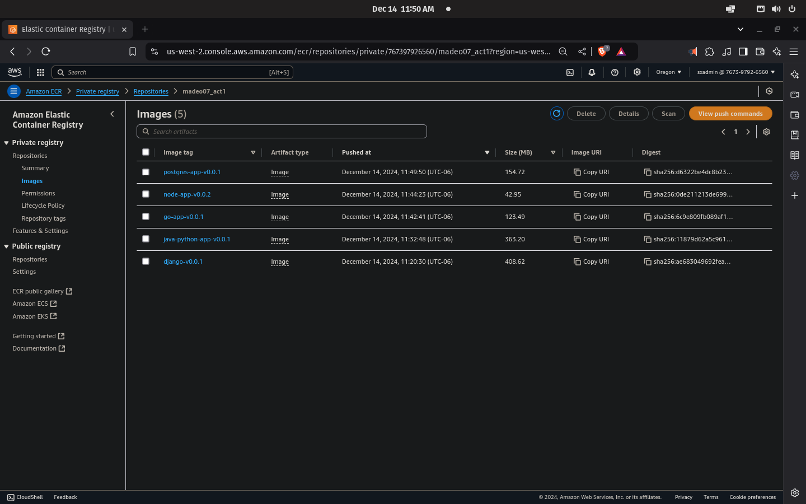

# Creación de aplicativos en contenedores
		madeo07_act1 - Saúl Xicoténcatl López

## Objetivo
Creación y almacenamiento de imágenes docker con la capacidad de instanciar contenedores de aplicaciones basadas en: Node,js, Go, Python y Java.

## Instrucciones

### Parte 1
- Montar tres contenedores cuyas aplicaciones correspondan a
	- Un lenguaje de programación diferente.
	- Estar expuestos en puertos diferentes.
	- y subir las imágenes correspondientes en ECR de AWS.
	
### Parte 2
* Ejecución de una aplicación
	- Basada en contenedores.
	- Ejecutándose a través de docker compose.
	

## Entorno de trabajo

### Ambiente local
Equipo con sistema operativo con distro de linux Ubuntu/debian Pop!_OS 22.04 LTS de 64 bits, con un nivel de usuario root temporal con el uso del comando *sudo* y la contraseña correspondiente.   


1. Instalación de Docker.

Con base en la documentación oficial, a través de la terminal, se monta la aplicación de docker descargando la versión compatible de ubuntu.

```sh
# Add Docker's official GPG key:
sudo apt-get update
sudo apt-get install ca-certificates curl
sudo install -m 0755 -d /etc/apt/keyrings
sudo curl -fsSL https://download.docker.com/linux/ubuntu/gpg -o /etc/apt/keyrings/docker.asc
sudo chmod a+r /etc/apt/keyrings/docker.asc

# Add the repository to Apt sources:
echo \
"deb [arch=$(dpkg --print-architecture) signed-by=/etc/apt/keyrings/docker.asc] https://download.docker.com/linux/ubuntu \
$(. /etc/os-release && echo "$VERSION_CODENAME") stable" | \
sudo tee /etc/apt/sources.list.d/docker.list > /dev/null
sudo apt-get update

sudo apt-get install docker-ce docker-ce-cli containerd.io docker-buildx-plugin docker-compose-plugin
```
Es posible validar con **sudo docker --version** y **sudo docker compose --version** la correcta instalación.


2. Usuario al grupo docker (opcional)

A fin de hacer el desarrollo un poco más ágil, se puede agregar  fácil se puede incorporar el usuario actual al grupo de docker con 

```sh
sudo usermod -aG docker $USER  
newgrp docker  
docker ps  
```
Ten en cuenta que la creación de base de datos con docker compose la mayoría de la veces requerirá usar explícitamente **sudo docker** por lo relevante que llega a ser la gestión de bases de datos. 

3. AWS CLI

La herramienta de comandos de AWS es necesaria para la sincronización entre en entorno local de desarrollo y el entorno de nube, comenzamos por instalar el cli con **sudo apt install awscli** y de forma opcional, se puede configurar con las credenciales:

```sh
aws configure
	└── AWS Access Key ID [None]: <access_id>
		AWS Secret Access Key [None]: <access_key>
		Default region name [None]: <region>
		Default output format [None]: 
```

### Servicios de nube

Para almacenar en AWS las imágenes generadas en local con **docker build ...**, se recomienda
* La creación de un usuario para tal propósito
* Crear y adjuntar política correspondiente, puede ser a través de una política a la medida con los siguientes privilegios sobre el servicio Elastic Container Registry (ecr):
	- Read:
		- BatchCheckLayerAvailability
		- GetAuthorizationToken
	- Action:
		- CompleteLayerUpload
		- PutImage
		- UploadLayerPart

* Uso de IAM para roles/permisos.

Por otra parte, se creará un servicio ECR que almacenará las imágenes con el nombre de la actividad.


Y siguiendo las mismas instrucciones del mismo servicio, es posible cargar las imágenes en el inventario ECR. 


## Desarrollo

### Aplicación con Node
1. Crear imágen con **docker build -t node-app:v0.0.2 .**
2. Crear contenedor con **docker run --name my-node-app -d -p 3000:3000 node-app:v0.0.2**

### Aplicación con Go
1. Crear imágen con **docker build -t my-go-app:v0.0.1 .**
2. Crear contenedor con **docker run --name my-go-app -d -p 8080:8080 my-go-app:v0.0.1**

### Aplicación con java y python
1. Crear imágen con **docker build -t my-java-python-app:v0.0.1 .**
2. Crear contenedor con **docker run --name my-java-python-app -p 8000:8000 my-java-python-app:v0.0.1**

### DB docker compose
1. crear archivo de dependencias, el dockerfile y docker-compose
2. **sudo docker compose run web django-admin startproject djangopostgreapp .** 


3. Editar **./djangopostgreapp/settings.py**, para ello, es recomendable detener el contenedor y abrir el archivo con privilegios de root con sudo, por ejemplo, **sudo nano djangopostgreapp/settings.py** y actualizar la base sqlite por postgres en el apartado de bases de datos como se muestra a continuación.

```sh
DATABASES = {
	'default': {
		'ENGINE': 'django.db.backends.postgresql',
		'NAME': 'postgres',
		'USER': 'postgres',
		'PASSWORD': 'postgres',
		'HOST': 'db',
		'PORT': 5432
	}
}
```
Al igual que agregar en el listado de host válido, el puerto '0.0.0.0'.


Para actualizar los cambios se requiere ejecutar **sudo docker compose run web python manage.py migrate**, una forma de ver cuántos procesos en el cambios de bases de datos ha ocurrido, puede ejecutarse **sudo docker compose run web python manage.py makemigrations**.

Y por último **sudo docker compose up**




### Almacenamiento de imágenes

Primero, revisaremos el inventario local de imágenes ejecutando **docker images**, 

	REPOSITORY               TAG       IMAGE ID       CREATED        SIZE
	django-postgre-app-web   latest    396fdbbbbded   20 hours ago   1.08GB
	my-java-python-app       v0.0.1    0d4f261b22cc   34 hours ago   788MB
	my-go-app                v0.0.1    3bf5ef8317c8   34 hours ago   323MB
	node-app                 v0.0.2    57230a4da76a   35 hours ago   119MB
	postgres                 latest    810c36706d00   3 weeks ago    435MB

donde django-postgre-app-web y postgres fueron generadas a través de docker compose.

Teniendo en cuenta que el CLI de AWS está previamente configurado, se ejecuta **aws ecr get-login-password --region <tu-region> | docker login --username AWS --password-stdin <tu-account-id>.dkr.ecr.<tu-region>.amazonaws.com** para la autenticación en el servicio ECR.

Aplicando el **docker tag <nombre-imágen>:<tag> <tu-id-de-cuenta>.dkr.ecr.<tu-región>.amazonaws.com/<nombre-repositorio>:<tag>** para cada una de las 5 imágenes y enviarlas con **docker push <tu-id-de-cuenta>.dkr.ecr.<tu-región>.amazonaws.com/<nombre-repositorio>:<tag>** 



## Conclusiones y recomendaciones

* **Empuje de imágenes**. El procesamiento de tageo y empuje de las imágenes creadas puede ser algo tardado y susceptible de errores, es por ello que, con las  variables de entorno como 

``` sh
#!/bin/bash  
  
# Exportar las variables necesarias  
export REPOSITORY_NAME="<nombre-repositorio>"  
export ACCOUNT_ID="<tu-id-de-cuenta>"  
export AWS_REGION="<tu-región>"  
  
# Autenticarse en ECR  
aws ecr get-login-password --region $AWS_REGION | docker login --username AWS --password-stdin $ACCOUNT_ID.dkr.ecr.$AWS_REGION.amazonaws.com  
  
# Obtener la lista de imágenes de Docker  
# Puedes filtrar las imágenes que deseas empujar si es necesario  
docker images | awk '{print $1 ":" $2}' | grep -v '<none>' | while read -r image; do  
    # Obtener el nombre de la imágen y la etiqueta  
    IMAGE_NAME=$(echo $image | cut -d':' -f1)  
    TAG=$(echo $image | cut -d':' -f2)  
  
    # Etiquetar la imágen para ECR  
    NEW_IMAGE="$ACCOUNT_ID.dkr.ecr.$AWS_REGION.amazonaws.com/$REPOSITORY_NAME:$TAG"  
    echo "Etiquetando $image como $NEW_IMAGE"  
    docker tag "$image" "$NEW_IMAGE"  
  
    # Empujar la imágen a ECR  
    echo "Empujando $NEW_IMAGE a ECR..."  
    docker push "$NEW_IMAGE"  
done  
  
echo "Proceso completado."  
```

* **Dockerignore**. Agregar el .dockerignore adecuado en la carga de imágenes relacionadas con bases de datos, puede simplificar considerablemente el tiempo de carga por dedicado a la optimización de imágenes.
```sh
# Ignorar archivos de configuración  
*.env  
*.json  
  
# Ignorar directorios de bases de datos  
db/  
data/  
  
# Ignorar archivos temporales  
tmp/  
*.log  
```


* **GitHub Actions**. Una vez definidas la images, es posible vincular un rama de git para que ejecute la versión actualizada del código, por ejemplo, la carga de las imágenes al registro de imágenes.


```sh
name: Build and Push Docker Images  
  
on:  
  push:  
    branches:  
      - main  # Cambia esto a la rama que desees  
  
jobs:  
  build:  
    runs-on: ubuntu-latest  
  
    steps:  
      - name: Checkout code  
        uses: actions/checkout@v2  
  
      - name: Set up Docker Buildx  
        uses: docker/setup-buildx-action@v1  
  
      - name: Log in to Amazon ECR  
        env:  
          AWS_REGION: ${{ secrets.AWS_REGION }}  
          AWS_ACCESS_KEY_ID: ${{ secrets.AWS_ACCESS_KEY_ID }}  
          AWS_SECRET_ACCESS_KEY: ${{ secrets.AWS_SECRET_ACCESS_KEY }}  
        run: |  
          echo "Logging in to Amazon ECR"  
          aws ecr get-login-password --region $AWS_REGION | docker login --username AWS --password-stdin ${{ secrets.ACCOUNT_ID }}.dkr.ecr.$AWS_REGION.amazonaws.com  
  
      - name: Build and push Docker images  
        env:  
          REPOSITORY_NAME: "<nombre-repositorio>"  # Cambia esto al nombre de tu repositorio  
          ACCOUNT_ID: ${{ secrets.ACCOUNT_ID }}  # Guarda tu ID de cuenta en los secretos  
          AWS_REGION: ${{ secrets.AWS_REGION }}  # Guarda tu región en los secretos  
        run: |  
          # Obtener la lista de imágenes de Docker  
          docker images | awk '{print $1 ":" $2}' | grep -v '<none>' | while read -r image; do  
              # Obtener el nombre de la imágen y la etiqueta  
              IMAGE_NAME=$(echo $image | cut -d':' -f1)  
              TAG=$(echo $image | cut -d':' -f2)  
  
              # Etiquetar la imágen para ECR  
              NEW_IMAGE="$ACCOUNT_ID.dkr.ecr.$AWS_REGION.amazonaws.com/$REPOSITORY_NAME:$TAG"  
              echo "Etiquetando $image como $NEW_IMAGE"  
              docker tag "$image" "$NEW_IMAGE"  
  
              # Empujar la imágen a ECR  
              echo "Empujando $NEW_IMAGE a ECR..."  
              docker push "$NEW_IMAGE"  
          done  
  
      - name: Logout from Amazon ECR  
        run: docker logout ${{ secrets.ACCOUNT_ID }}.dkr.ecr.$AWS_REGION.amazonaws.com  
```


## Referencias

### Oficiales
* https://hub.docker.com/
* https://docs.docker.com/engine/install/ubuntu/
* https://go.dev/doc/install
* https://docs.aws.amazon.com/AmazonECR/latest/userguide/Registries.html#registry_auth
* https://docs.aws.amazon.com/cli/latest/userguide/getting-started-install.html

### Complementarias
* Contenedor para una app con Node. https://www.youtube.com/watch?v=cAFGcfIyKgI
* Contenedor para una app con Go. https://www.youtube.com/watch?v=C5y-14YFs_8
* imágenes en ECR de AWS. https://www.youtube.com/watch?v=-tMxr6CqynQ